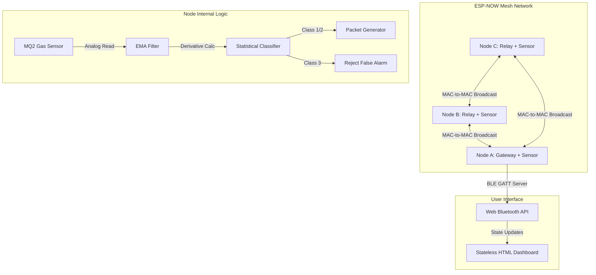

# IGNIS: Offline Mesh Fire Alarm System

### What It Is

IGNIS is a masterless, self-healing fire detection network built on ESP32 microcontrollers. It uses the ESP-NOW protocol to create a localized wireless mesh that operates completely independent of routers, the internet, or central building wiring. It processes analog gas data using a local Edge AI statistical classifier to prevent false alarms and streams real-time threat data to a local browser via Web Bluetooth.

### Why We Developed It

The current fire safety market is broken into three vulnerable categories.

1. Legacy smoke detectors are isolated. A fire in the basement will not trigger the top floor alarm until the smoke physically travels there.
2. Smart IoT alarms rely on cloud servers and Wi-Fi routers. If a fire melts the router or cuts the main power grid, the system loses connectivity and downgrades to a dumb isolated alarm.
3. Heavy commercial alarms rely on centralized copper wiring. A single burnt wire bundle can take down an entire wing of a building.

We built this system to completely eliminate infrastructure dependency. It requires no apps, survives total internet outages, routes around destroyed nodes automatically, and uses math to filter out false alarms locally.

### Architectural Flow

### Technical Implementation

**ESP-NOW Mesh Protocol**
The network communicates via ESP-NOW, a connectionless Wi-Fi protocol operating at the MAC layer. To ensure zero packet loss from standard Wi-Fi channel hopping, the radio hardware on all nodes is explicitly locked to Channel 1 using the promiscuous mode bypass in `esp_wifi.h`. The topology is a flooding mesh where every node repeats every message it hears.

**Broadcast Storm Prevention**
A dumb flooding mesh will instantly crash itself in an infinite echo loop. To solve this, every fire event generates a cryptographically random 32-bit unique message ID via the ESP32 hardware RNG. Each node maintains a rolling buffer array of the last 10 processed IDs. Before handling any incoming MAC packet, the node scans the buffer. If the ID is a duplicate, the packet is dropped at the radio layer to keep emergency bandwidth clean.

**Edge AI Statistical Classification**
Instead of using a static analog threshold that causes false alarms for burnt toast, the nodes calculate the mathematical rate of gas expansion.
The system smooths noisy analog reads using an Exponential Moving Average with an alpha of 0.2. Every 3 seconds, it calculates the derivative of the EMA.

* Class 1 (Flash Fire): Rate of change exceeds 100. Instant alarm triggered regardless of baseline threshold.
* Class 2 (Smoldering Fire): Rate of change exceeds 20 and crosses the dynamic baseline threshold. Alarm triggered.
* Class 3 (Anomaly): Rate of change is below 5 but crosses the threshold. The system classifies this as a slow environmental anomaly like cooking smoke. The packet is dropped and the alarm is suppressed.

**Dynamic Baselines & State Latching**
On boot, each node spends 10 seconds polling the environment to calculate a dynamic floating baseline, allowing the mathematical threshold to adapt to different ambient environments. Once a fire state is triggered, the system enforces a 10000ms state latch. This prevents hardware buzzer stuttering caused by the sensor's analog output dipping above and below the threshold line while smoke is clearing.

**Web Bluetooth Dashboard (Zero-App UI)**
To bypass the restrictive push-notification rules of modern mobile operating systems, we abandoned native apps. Node A runs a local BLE GATT server broadcasting a specific Service UUID. A stateless HTML/JS file running locally on any laptop or Android device connects to the gateway via the Web Bluetooth API. The gateway pushes string notifications representing the ML classification state directly to the DOM, creating a live command center that requires zero installation and zero internet.
